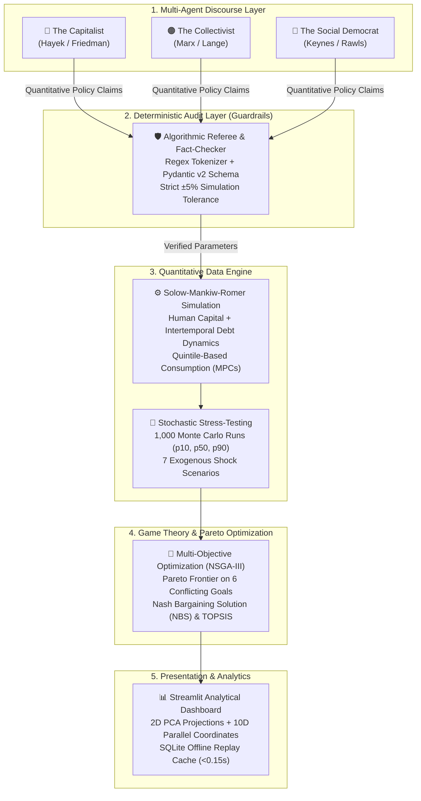

# 🏛️ AI Economic Council (Consejo Económico de IA)
### Multi-Agent Debate Platform with Deterministic Macroeconomic Simulation, Anti-Hallucination Auditing & Pareto Optimization (NSGA-III)

[](https://www.python.org/downloads/)
[](https://opensource.org/licenses/MIT)
[](tests/)
[](https://streamlit.io/)
[](https://docs.pydantic.dev/)
[](https://pymoo.org/)

> **⚠️ ACADEMIC & RESEARCH DISCLAIMER:** Simplified computational system built for research, education, and dissemination in quantitative economics, data engineering, and multi-agent AI alignment. It does not constitute formal public policy advice.

---

## 📌 Overview / Resumen

What happens when you seat a **Capitalist**, a **Marxist Collectivist**, and a **Nordic Social Democrat** (autonomous LLM agents) to design a national economic reform, but subject every single claim to **strict mathematical validation**?

The **AI Economic Council** is an end-to-end data platform where LLMs generate qualitative policy arguments, while a **deterministic data engine, stochastic Monte Carlo stress-testing, and multi-objective Pareto optimization (NSGA-III)** audit, compute, and negotiate the optimal mathematical consensus.



---

## 🌟 Key Engineering Features

### 1. 🛡️ Deterministic Anti-Hallucination Fact-Checking Engine
- **Zero-Tolerance for Fabricated Metrics:** Uses decimal regex tokenization to intercept numeric claims in real time.
- **Pydantic Validation:** Maps semantic terms (*Gini, GDP, Unemployment, Public Debt, Interest Rate*) directly to simulation arrays with a strict $\pm 5\%$ tolerance.
- **Automated Score Penalization:** If an agent hallucinates numbers, the Referee revokes the claim, penalizes the rigor rubric, and flags the discrepancy.

### 2. ⚙️ Micro-founded Macroeconomic Simulation Engine
- **Solow-Mankiw-Romer-Weil Production Function:** Incorporates physical capital ($\alpha=0.30$), human capital ($\beta=0.25$), and effective labor:
  $$Y_t = A_t \cdot K_t^\alpha \cdot H_t^\beta \cdot L_{eff, t}^{1 - \alpha - \beta}$$
- **Dynamic Intertemporal Sovereign Debt:**
  $$\Delta b_t = (r_t - g_t) b_{t-1} - pb_t + \xi_t$$
  Includes sovereign risk spread scaling exponentially if debt exceeds 60% of GDP.
- **Quintile Consumption Disaggregation:** Micro-founded marginal propensities to consume ($MPC = [0.96, 0.88, 0.78, 0.68, 0.52]$) for endogenous Gini index tracking.

### 3. 🎲 Stochastic Monte Carlo & Stress-Testing Pipeline
- **1,000 Stochastic Iterations** across 30-year projections with percentile confidence intervals ($p10, p50, p90$).
- **7 Exogenous Shock Scenarios:** Pandemics, Global Recessions, Commodity Crashes, Demographic Aging, AI Disruption, Sovereign Debt Crises, and Baseline.

### 4. 🎯 Multi-Objective Optimization & Game Theory (NSGA-III)
- **Pareto Frontier Search (pymoo):** Evaluates trade-offs across 6 conflicting objectives (GDP per capita, Gini index, Unemployment, Sovereign Debt, Resilience, and Social Welfare).
- **Axiomatic Consensus Synthesis:** Resolves negotiations using **Nash Bargaining Solution (NBS)**, **Kalai-Smorodinsky**, **TOPSIS**, and **Knee Point** analysis subject to agent red lines and vetoes.

### 5. 🖥️ Interactive Visual Analytics Dashboard (Streamlit)
- **View A (Debate Arena):** Live turn-by-turn replay, LLM chat bubbles, fact-checking badges.
- **View B (Convergence & Geometry):** 2D PCA projection of agent trajectory, 10D parallel coordinates, and concession divergence charts.
- **View C (Metrics Board):** KPI cards ($\Delta\%$), 30-year Monte Carlo trajectories, normalized radar charts, and shock resilience heatmaps.
- **View D (Final Consensus):** Policy compromise breakdown, barycentric ternary plot, and 2D/3D Pareto cloud.
- **View E (Rigor & Scientific Audit):** Fact-checking error logs, rubric evaluations, and automated statistical findings.

---

## 🚀 Quick Start Guide

### Prerequisites
- Python 3.10 or higher
- Optional: Groq API Key (for real-time live LLM debates; not required for offline replay)

### 1. Clone & Install Dependencies
```bash
git clone https://github.com/Luis-galvis/DEBATEAI.git
cd debate
python -m venv venv
# Windows:
.\venv\Scripts\activate
# Linux/macOS:
# source venv/bin/activate

pip install -r requirements.txt
```

### 2. Environment Setup (Optional for Live Mode)
```bash
cp .env.example .env
# Edit .env and insert your GROQ_API_KEY if running live LLM calls
```

### 3. Launch the Interactive Streamlit Dashboard
```bash
python -m streamlit run src/app/dashboard.py
```
*Opens automatically at `http://localhost:8501`.*

### 4. Run CLI Modes

* **Offline Instant Replay (<0.15s via SQLite cache):**
  ```bash
  python run_debate.py --replay --country colombia
  ```
* **Live Multi-Agent Debate (GroqCloud LLM Calls):**
  ```bash
  python run_debate.py --mode live --country colombia
  ```
* **Execute Test Suite (23 Unit Tests):**
  ```bash
  python -m pytest -v tests/
  ```
* **Run Scientific & Red-Team Audits:**
  ```bash
  python scripts/run_scientific_audits.py
  ```

---

## 📁 Repository Architecture

```text
debate/
├── config/                    # Pydantic-validated parameters (economic_parameters.yaml)
├── data/                      # Real calibration datasets (Colombia, Sweden, USA)
├── docs/                      # Technical architecture documentation & slide decks
│   └── DOCUMENTO_TECNICO_ARQUITECTURA.md  # Full engineering deep-dive
├── outputs/                   # Golden runs, JSON logs, and verified reports
├── src/
│   ├── agents/                # Debater archetypes, Referee, and SQLite Cache
│   ├── simulation/            # Solow-Swan engine, Monte Carlo, shock models
│   ├── optimization/          # NSGA-III (pymoo), Nash, TOPSIS, Kalai-Smorodinsky
│   ├── reporting/             # Automated markdown/PDF report generators
│   └── app/                   # Streamlit Dashboard (6 views + PCA viz)
├── tests/                     # 23 Automated unit tests (pytest)
├── run_debate.py              # Main execution entrypoint
├── LICENSE                    # MIT License
└── README.md                  # Project Documentation
```

---

## 👨‍💻 Author & Engineering Profile

**Luis Fernando Galvis Moreno**  
*Data Engineer | Risk Data & ETL Pipelines | Applied AI Systems*  
📍 Ibagué, Colombia (Available for Global Remote)  
📧 [lgalvismoreno@gmail.com](mailto:lgalvismoreno@gmail.com)  
🔗 [LinkedIn Profile](https://www.linkedin.com/in/luis-fernando-galvis-moreno/)

---

## 📜 License

This project is licensed under the **MIT License** - see the [LICENSE](LICENSE) file for details.
